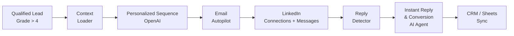
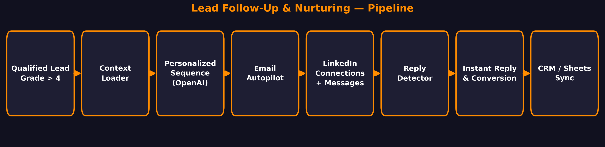

# Lead Follow-Up & Nurturing Automation (n8n)

An automated follow-up and nurturing system built on n8n + OpenAI. Once a lead is qualified, this system takes over: it builds a personalized multi-touch sequence for that specific lead, runs the touches across email and LinkedIn on a schedule, detects replies, and handles the reply conversation so no warm lead goes cold from slow or missing follow-up.

## Problem

Most leads are lost after the first touch — not because they said no, but because nobody followed up. Manual follow-up doesn't scale: personalizing each touch, remembering the schedule, and replying fast across email and LinkedIn is more than one person can do consistently. Touches go out late, generic, or not at all — and warm leads quietly go cold.

## How It Works

Every qualified lead flows through one pipeline:

| # | Stage | What happens |
|---|-------|--------------|
| 1 | Qualified Lead Intake | A scored lead enters the pipeline (Grade > 4 from the lead-scoring system) |
| 2 | Context Loader | The lead's enriched profile — role, company, pain points, recent activity — is loaded into the run |
| 3 | Personalized Sequence Builder | OpenAI writes a multi-touch sequence from the lead context; every touch is written for that lead, not a template |
| 4 | Email Autopilot | Scheduled email touches go out with waits between them, throttled per sender |
| 5 | LinkedIn Touchpoints | Connection requests and follow-up messages run alongside the email track |
| 6 | Reply Detector | Incoming replies are detected and classified (OpenAI); the sequence stops for that lead on reply |
| 7 | Instant Reply & Conversion | An AI agent handles the reply conversation and moves the lead toward the next step |
| 8 | Activity Sync | Every touch, reply, and outcome is logged to the CRM / Google Sheets |

## Tech Stack

| Component | Purpose |
|---|---|
| n8n | Orchestration: scheduling, waits, branching, webhooks |
| OpenAI | Touch personalization, reply detection/classification, agent reasoning |
| Email sending tool | Automated, throttled email touches (e.g. Instantly / Smartlead style tooling) |
| LinkedIn | Connection requests + follow-up messaging |
| CRM / Google Sheets | Touch and outcome logging |

## Build It Yourself

The import-ready workflow file is private, but the architecture above is complete enough to rebuild:

1. **Trigger**: a scored lead (Grade > 4) enters — e.g. a webhook from the lead-scoring system or a new row in the leads sheet.
2. **Context**: pull the lead's enriched profile (role, company, pain points, recent activity) and store it in the workflow's data.
3. **Personalization**: call the OpenAI node with the lead context and ask for a 5–7 touch sequence (subject lines, email bodies, LinkedIn connection note, LinkedIn follow-ups). Each touch references something specific about the lead.
4. **Sequencer**: Wait nodes between touches (days apart). Split the flow: one branch for email touches, one for LinkedIn touches, so the channels run in parallel.
5. **Reply handling**: a webhook catches replies. An OpenAI node classifies the reply (positive / question / objection / unsubscribe). Positive replies stop the sequence for that lead and route to the AI agent.
6. **Agent**: an AI Agent node (OpenAI chat model + conversation memory) answers the reply and moves toward the next step — e.g. offering a call slot. Give it tools: calendar availability, CRM lookup.
7. **Sync**: log every touch, reply, and outcome to the CRM or Google Sheets so the full history is visible per lead.

## Capabilities

- Multi-touch follow-up across email and LinkedIn, running in parallel
- Every touch personalized from the lead's own context — no generic templates
- Reply detection stops the sequence automatically; no "oops, we already emailed" moments
- Every touch and outcome logged for full visibility

## Notes

- Email deliverability depends on proper sender setup (warmed domains, SPF/DKIM/DMARC); the workflow throttles sending accordingly.
- LinkedIn automation must respect LinkedIn's usage limits; the workflow spaces touchpoints out.
- The import-ready `workflow.json` is not published (private build); this repo documents the architecture.

## License

MIT — architecture and docs are free to learn from and rebuild.
